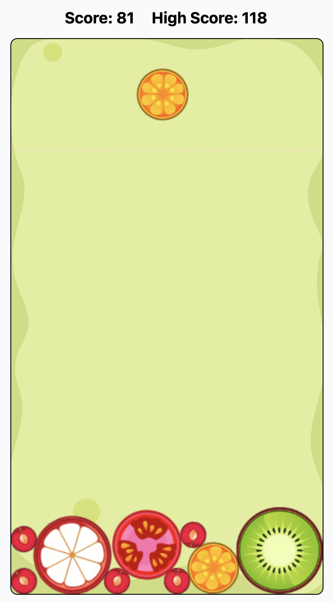

# 🍉 Suika Game Clone

A web-based clone of the popular Suika (Watermelon) Game, built with Next.js, TypeScript, and Matter.js.

👉 **[Play Now: suika-melon.com](https://suika-melon.com)**



## 🎮 About The Game

Suika Game is a physics-based puzzle game where players combine fruits of the same type to create larger ones. The goal is to achieve the highest score possible by merging fruits strategically while managing the limited space in the container.

## ✨ Features

- 🎯 Faithful recreation of the original Suika Game mechanics
- 📱 Responsive design - play on any device
- 🏆 Weekly leaderboard system
- 🎨 Smooth animations and physics
- 🌐 Fully playable in web browsers

## 🛠 Tech Stack

- Next.js 14
- TypeScript
- Matter.js for physics simulation
- TailwindCSS for styling
- Vercel for deployment

## 🚀 Getting Started

1. Clone the repository:

```bash
git clone https://github.com/[your-username]/suika-game.git
```
